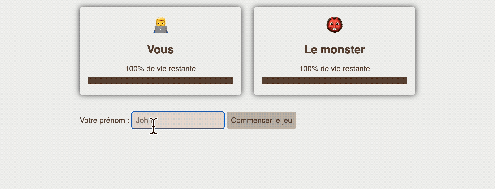
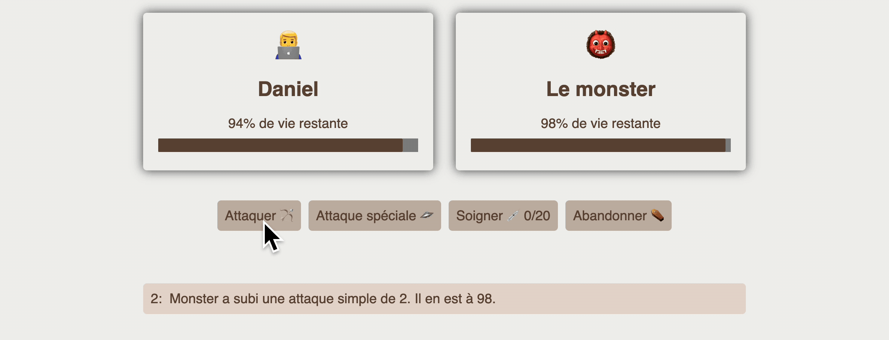
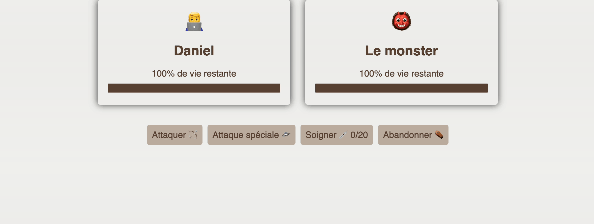
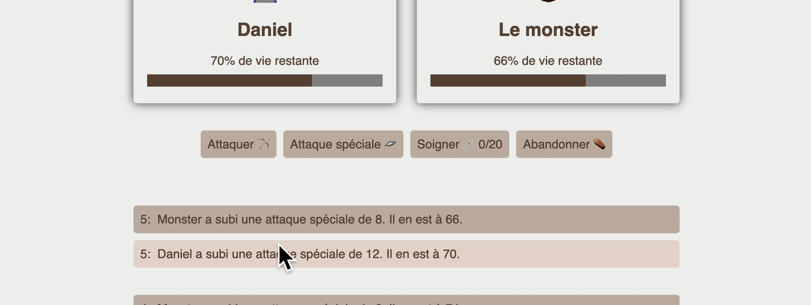
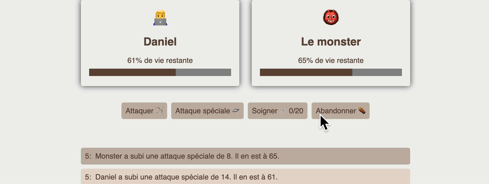
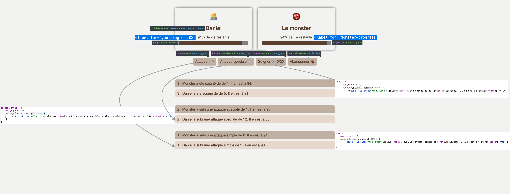
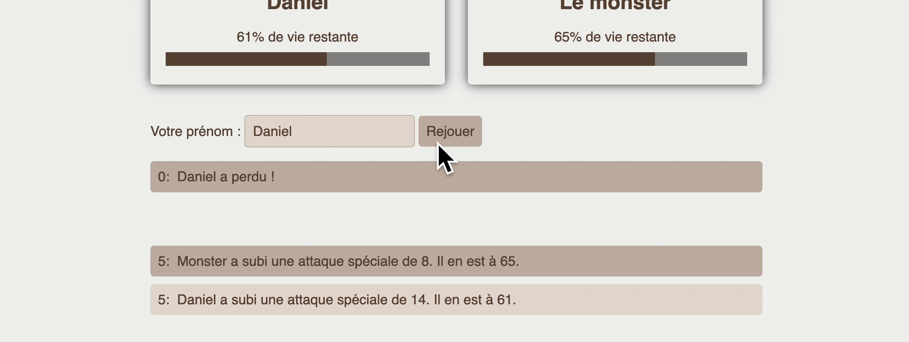

# Monster game

> Examen DCC — janvier 2024

## Préambule

1. Dans le cadre de cet examen de *Développement Côté Client* vous devez uniquement vous focaliser sur les fichiers
   JavaScript. Mis à part, ajouter ou modifier une balise `script`, on ne vous demande pas de modifier le code HTML ni
   le code CSS qui s'y rapporte.
1. Cet examen dure *maximum 4 heures*.
1. Vous devez respecter  [les bonnes pratiques vues en classe](https://github.com/hepl-dcc/dcc-guidelines).
1. Tous les sélecteurs CSS dont vous avez besoin (pour cibler les éléments du DOM) ainsi que les paramètres du jeu sont
   définis dans l'objet `settings` du fichier `src/js/settings.js`.
1. Vous pouvez, si vous le souhaitez, réaliser l'examen en TypeScript.

## Énoncé 🎯

1. **Initialiser quelques données :**

    1. Créez une classe `Player` avec deux propriétés : le nom (`name`), passé en paramètre au constructeur, et la santé (`health`), initialisée à 100 (cf. `settings.health_max_value`).
    2. Déclarez un tableau contenant deux joueurs dans l'ordre avec comme noms respectifs `You` (cf. `settings.defaultPlayerName1`) et `Monster` (cf. `settings.defaultPlayerName2`).
    
2. **Soumission du formulaire `#play-game` :**

    1. Mettez à jour le nom du premier joueur dans le tableau (`players[0].name`) en utilisant la valeur de l'input, par exemple : `event.currentTarget.querySelector('input').value`. 👌

    2. Mettez à jour le contenu textuel de la carte du premier joueur avec l'identifiant `#player-name` (cf. `strings.playerNameId`).

    3. Faites disparaître le formulaire en lui ajoutant la classe `visuallyhidden`.

    4. Faites apparaître l'élément `div.controls` en retirant la classe `visuallyhidden` à la div.

       

3. **Écouteur d'événement sur le bouton `#attack` :**

    Quand on clique, ajoutez un nombre aléatoire entre 0 et -7 à la santé de chaque joueur (cf. `settings.actions.attack.max_impact`).

    

4. **Écouteur d'événement sur le bouton `#special-attack` :**

    Quand on clique, ajoutez un nombre aléatoire entre 0 et -14 à la santé de chaque joueur (cf. `settings.actions.special_attack.max_impact`).

    

5. **Écouteur d'événement sur le bouton `#heal` :**

    Quand on clique, ajoutez un nombre aléatoire entre 0 et +7 à la santé de chaque joueur (cf. `settings.actions.heal.max_impact`).

    

6. **Fonction générique pour les boutons :**

    Créez une fonction générique utilisant l'attribut `data-name` du bouton pour accéder à l'objet correspondant dans `settings.actions`. Essayez de condenser les trois fonctions existantes en une seule. Si vous disposez d'une fonction générique qui s'exécute au clic, l'expression `settings.actions[event.currentTarget.dataset.name].max_impact` vous donne la valeur maximale en fonction du bouton qui vient d'être cliqué.

7. **Vérification de la mort des joueurs :**
   Dans la fonction générique, vérifiez si l'un des joueurs est mort. Si c'est le cas :

   1. Affichez le formulaire `#play-game` (retirez la classe `visuallyhidden`).
   2. Cachez la `div.controls` (ajoutez la classe `visuallyhidden`).
   3. Ajoutez un message dans le formulaire `#play-game` indiquant le perdant (utilisez `settings.messages.lost()`).

    

8. **Vérification du bouton "give-up" :**

    Dans la fonction générique, testez si le bouton cliqué a l'attribut `data-name="give-up"`.
    - Si c'est le cas, effectuez les mêmes actions que pour la vérification de la mort des joueurs.

    
## Classes et identifiants des éléments HTML
Voici une capture d'écran annotée, présentant des informations sur les classes et identifiants les éléments HTML.
    

## Bonus 👌

9. **Soumission du formulaire après la fin du jeu :**

    1. Réinitialisez la santé des deux joueurs à 100 (cf. `settings.health_max_value`).
    2. Retirez le message `p.log__item` du formulaire.
    3. Cachez le formulaire `#play-game` (retirez la classe `visuallyhidden`).
    4. Montrez la `div.controls` (ajoutez la classe `visuallyhidden` à la div).

    
